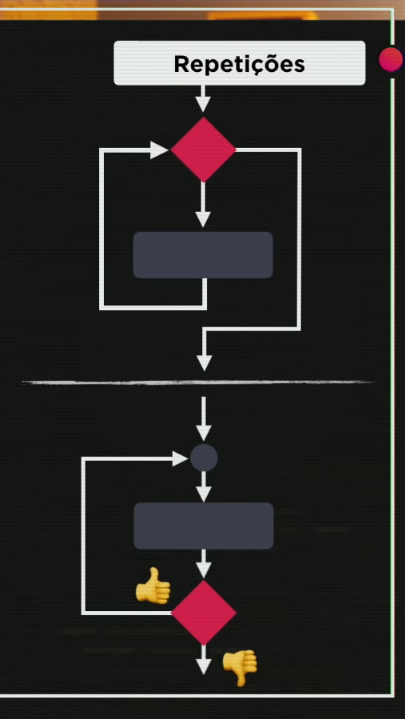

# Estruturas de repetição

Das estruturas de controle existentes na programação, as principais são sequencias, condições e as repetições

Assim como condicões, estruturas de repetição tem 2 resultados booleanos: verdadeiro ou falso. A diferença entre elas é o comportamento

Condicionais: Se --- for verdadeiro, faça ---, senão faça ---.
Repetições: Enquanto --- for verdadeiro, faça ---.

## While loop

while loop é uma estrutura de repetição que executa um bloco de código enquanto a condição for verdadeira.

```js
while (condição) {
    // código
}
```

While loop é classificado como uma estrutura de repetição com teste no início, ou seja, a condição é verificada antes da execução do bloco de código.

## Do while loop

do while loop é uma estrutura de repetição que executa um bloco de código enquanto a condição for verdadeira.

```js
do {
    // código
} while (condição)
```

Do while loop é classificado como uma estrutura de repetição com teste no final, ou seja, a condição é verificada após a execução do bloco de código.
