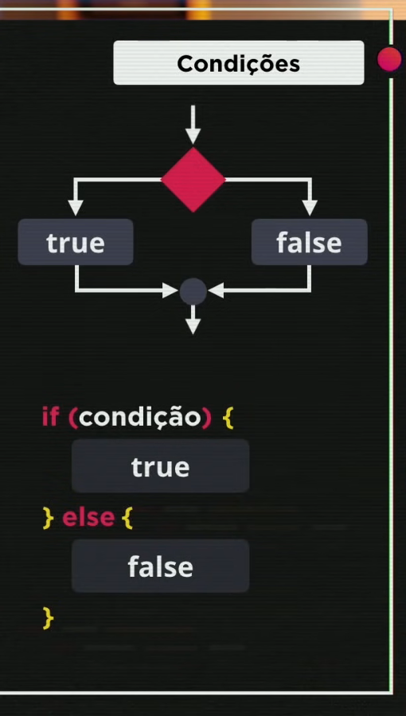

# Condicionais
Existem 2 tipos de scripts em js

1. Sequências
    Sequências são scripts executados de cima para baixo, sem nenhum desvio de fluxo.
2. Condicionais
    Condicionais são blocos de código variável, ou seja, o código a ser executado depende de outro fator. Os valores possíveis são booleanos, ou seja, verdadeiro ou falso.

Toda linguagem de programação imperativa possui condicionais, e em js não é diferente. Os condicionais em js são `if`, `else if` e `else`.

```js
if (condição) {
    // código a ser executado (SE)
} else if (condição) {
    // código a ser executado (SE NÃO)
} else {
    // código a ser executado (CASO NENHUMA DAS CONDIÇÕES ACIMA SEJA VERDADEIRA)
}
```


```js
if (){
    // condição simples
}
```

```js
if (){
    // condição simples
} else {
    // condição composta
}
```

```js